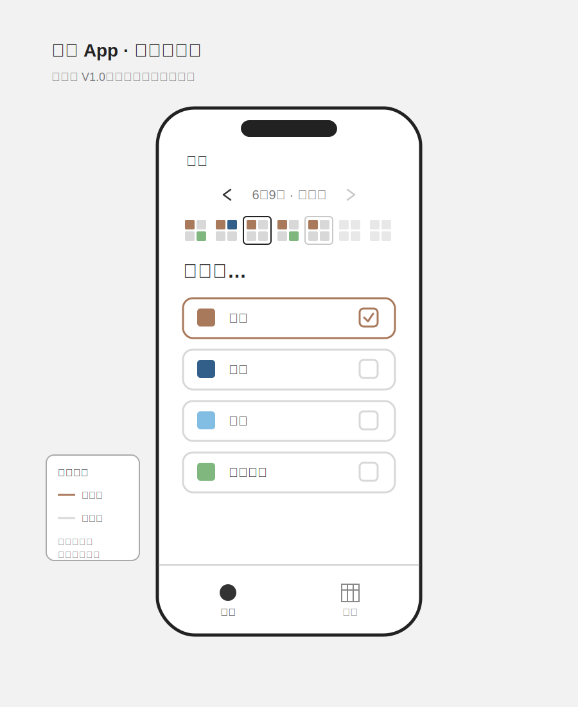
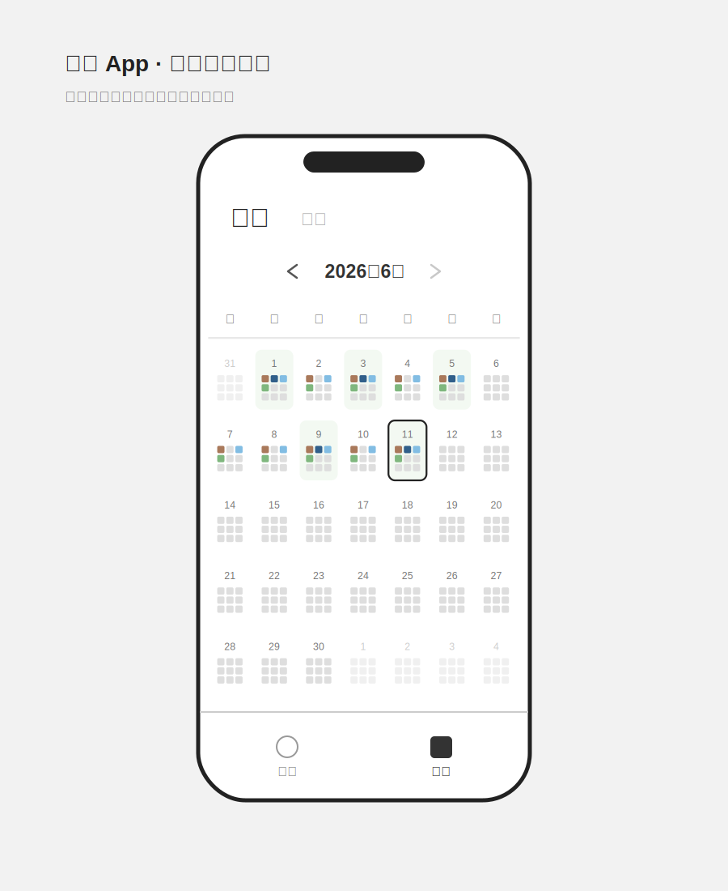
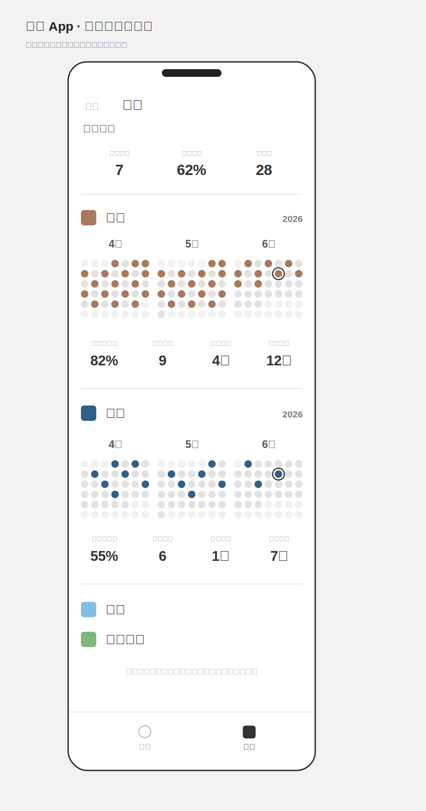

# 万岁 App 产品需求文档

## 1. 文档信息

| 项目 | 内容 |
| --- | --- |
| 产品名称 | 万岁 |
| 版本 | V1.0 |
| 产品经理 | Sally |
| 最后更新 | 2026-06-15 |
| 文档状态 | V1.0 最终确认 |

### 1.1 平台与安装方式

- V1.0 为可安装网页 App（PWA），优先适配 iPhone Safari。
- 网页代码托管在 GitHub，并通过 GitHub Pages 发布。
- 用户使用 Safari 打开网址后，通过「添加到主屏幕」安装。
- V1.0 不发布到 App Store，也不需要 Xcode 签名。
- App 支持主屏幕图标、独立窗口和基础离线访问。

### 1.2 云端方案

- 使用 Supabase 提供云端数据库，不启用正式用户注册和身份验证。
- V1.0 为单用户版本，唯一用户名固定为 `ysw`。
- 用户首次打开时输入 `ysw` 即可进入 App。
- 登录成功标记保存在当前手机浏览器本地，后续打开时直接进入首页。
- 云端数据是正式数据源，本地缓存用于加快打开速度和短暂离线查看。
- 用户更换手机或清除浏览器数据后，重新输入 `ysw` 即可恢复同一套云端记录。
- 用户名不是密码，也不构成安全身份验证；知道网址和用户名的人可以访问或修改这套数据。
- 固定任务定义写在网页代码中，云端只保存单用户设置和打卡记录。

## 2. 产品概述

### 2.1 产品定位

「万岁」是一款轻量的每日任务打卡 App。用户通过简单勾选记录每天完成的事情，并通过周、月和单任务视图回顾自己的完成情况。

### 2.2 V1.0 目标

- 用户可以快速完成或取消某一天的任务打卡。
- 用户可以通过一周概览理解近期完成情况。
- 用户可以通过月历查看每天各任务的完成情况。
- 用户可以查看每个任务最近三个月的记录和关键数据。
- 所有记录保存到云端，并在当前设备保留本地缓存。
- 在其他设备输入 `ysw` 后，可以恢复同一套云端记录。

### 2.3 目标用户

希望记录日常行为，但不需要复杂计划、社交或奖励机制的用户。

## 3. 版本范围

### 3.1 本期包含

- 首页日期切换。
- 从固定生效日期 `2026-06-10` 起的历史日期任务打卡。
- 固定用户名登录和记住登录状态。
- 一周四任务摘要。
- 全部任务卡片列表。
- 月历九宫格任务摘要。
- 每日完成率背景。
- 任务本月总览。
- 单任务最近三个月记录。
- 单任务完成率、次数和连续天数。
- 云端数据保存与本地缓存。
- 基础离线查看。

### 3.2 本期不包含

- 用户注册、密码、邮箱验证码和第三方账号登录。
- 任务新增、编辑、删除和排序功能。
- 提醒和系统通知。
- 文字、图片、心情或备注。
- 分享、社交、排行、积分和成就。
- 搜索、筛选和导出。
- 本文档未定义的其他统计图表。

## 4. 信息架构

App 包含两个一级页面：

1. **首页**：切换日期并完成任务打卡。
2. **记录页**：通过「月历」和「任务」两个 Tab 查看历史记录。

未保存登录状态时首先进入登录页，输入 `ysw` 后进入首页。

底部导航用于在首页和记录页之间切换。

### 4.1 登录页

- 页面只包含产品名、用户名输入框和进入按钮。
- 仅当输入内容完全等于 `ysw` 时进入 App。
- 输入错误时提示「用户名不正确」。
- 登录成功后在当前浏览器保存登录标记。
- 用户重新打开 App 时，如果登录标记仍存在，则直接进入首页。
- V1.0 不提供注册、找回密码或验证码流程。

### 4.2 高保真 UI

- [登录页 UI](./design/high-fidelity/万岁-登录页UI.svg)
- [首页 UI](./design/high-fidelity/万岁-首页UI.svg)
- [月历 UI](./design/high-fidelity/万岁-月历UI.svg)
- [任务记录 UI](./design/high-fidelity/万岁-任务记录UI.svg)
- [UI 设计规范](./design/high-fidelity/UI-DESIGN.md)

## 5. 通用规则

### 5.1 任务

- V1.0 的任务由系统预制，直接内置在网页代码中。
- 首页展示全部系统预制任务。
- V1.0 不提供任务管理入口。
- 每个任务包含任务 ID、名称、颜色和顺序。
- 系统预制任务及固定顺序：

| 顺序 | 任务 | 颜色 |
| --- | --- | --- |
| 1 | 拉屎 | 棕色 |
| 2 | 早睡 | 深蓝色 |
| 3 | 运动 | 淡蓝色 |
| 4 | 饮食健康 | 绿色 |

- 预制任务名称、颜色和顺序在 V1.0 中不可修改。
- 田字格、九宫格、任务列表和任务记录均使用以上固定顺序。

### 5.2 打卡

- 用户可以为固定生效日期 `2026-06-10` 起（含当天）至今天之间的日期完成、取消任务打卡。
- 最早可操作日期固定为 `2026-06-10`。
- `2026-06-10` 之前的日期不参与统计，也不可新增、取消或修改。
- 不允许切换至未来日期进行打卡。
- 同一个任务在同一天最多存在一条有效记录。
- 取消打卡时不删除记录，而是将该记录的 `completed` 更新为 `false`。
- 已打卡状态使用任务颜色，未打卡状态使用浅灰色。

### 5.3 日期

- 日期计算使用设备本地日期。
- 星期顺序统一为周日至周六。
- 今天、当前选中日期和未来日期按照各页面规则分别展示。
- 用户修改设备日期或时区后，App 按新的设备本地日期重新计算今天、可补打卡范围和全部统计。

### 5.4 数据同步

- 用户打卡或取消打卡时必须有网络。
- 操作提交成功后，再更新本地界面和缓存。
- 无网络时允许查看已缓存数据，但不能新增、取消或修改打卡。
- 无网络时点击勾选按钮，提示「网络不可用，暂时不能打卡」。
- 同一任务、同一天在云端最多存在一条有效记录。
- 同一条记录在多设备发生冲突时，以最后成功同步到云端的操作为准。
- 云端更新时间由数据库生成，不采用手机本地时间判断同步先后。
- 云端保存失败时保持原状态，并提示用户稍后重试。

### 5.5 数据摘要顺序

所有摘要组件均按照首页任务顺序映射：

- 首页田字格摘要前 4 个任务。
- 月历九宫格摘要全部 4 个系统任务，其余 5 格未占用。
- 超出摘要容量的任务仍在首页和任务详情页正常展示。

### 5.6 百分比展示

- 总完成率、本月打卡率等百分比统一四舍五入为整数显示。
- 是否达到 50% 等业务判断使用未取整的真实比例，不使用显示值判断。

## 6. 首页

### 6.1 页面目标

用户进入 App 后，可以查看指定日期的任务状态并完成或取消打卡。

### 6.2 线框图

### 6.3 页面结构

从上到下依次为：

1. 产品名「万岁」。
2. 日期切换区。
3. 当前自然周摘要。
4. 标题「我做了…」。
5. 全部任务卡片。
6. 底部导航。

### 6.4 日期切换

- 首次进入时默认选中今天。
- 日期文字与左右箭头组成紧凑的居中导航组。
- 左右箭头使用浅灰色圆角按钮背景，不显示描边。
- 按钮实际点击区域不小于 `44×44 CSS px`。
- 左箭头切换至前一天。
- 右箭头切换至后一天。
- 选中今天时，右箭头不可继续进入未来。
- 到达固定生效日期 `2026-06-10` 时，左箭头不可继续进入更早日期。
- 切换日期后，周摘要和任务卡片同步更新。

### 6.5 当前自然周摘要

- 展示选中日期所在自然周，共 7 个田字格。
- 顺序固定为周日至周六，但不显示星期文字。
- 每个田字格代表一天，由 `2×2` 四个小方块组成。
- 四个位置依次对应前 4 个任务：

| 位置 | 对应任务顺序 |
| --- | --- |
| 左上 | 第 1 个任务 |
| 右上 | 第 2 个任务 |
| 左下 | 第 3 个任务 |
| 右下 | 第 4 个任务 |

- 已打卡方块显示任务颜色。
- 未打卡及未来日期方块显示浅灰色。
- 当前选中日期显示黑色细外框。
- 今天未被选中且位于当前周内时，显示灰色细外框。
- 其他过去日期不显示外框。
- 同一周内切换日期时，仅移动选中框并更新任务状态。
- 跨周切换时，整组更新为新选中日期所在自然周。

### 6.6 任务卡片

每条任务卡片从左到右为：

1. 任务颜色竖向圆角色块，仅用于任务识别。
2. 任务名称。
3. 勾选按钮。

状态规则：

- 未打卡：卡片为灰色线框，勾选按钮为空。
- 已打卡：卡片为任务颜色线框，勾选按钮显示完成状态。
- 点击勾选按钮后，对应按钮进入保存中状态并暂时禁止重复点击。
- 云端保存成功后，更新任务卡片、周摘要、本地缓存及相关统计视图。
- 云端保存失败时保持原状态，并提示「保存失败，请稍后重试」。
- 再次点击可取消打卡。
- 无论当前选中今天还是历史日期，标题均固定显示「我做了…」，具体日期由上方日期区表达。

## 7. 记录页通用结构

记录页包含两个文字 Tab：

- **月历**
- **任务**

Tab 规则：

- 两个页面使用完全相同的坐标、基线和文字间距。
- 选中 Tab 使用大字号、粗体和深色。
- 未选中 Tab 使用较小字号、常规字重和浅色。
- 不显示图标、外框、底框或装饰线。
- 首次进入记录页默认选中「月历」。
- 切换 Tab 不修改任何打卡数据。

## 8. 月历 Tab

### 8.1 页面目标

用户可以按月查看每天 4 个系统预制任务的打卡状态，以及当天整体完成情况。

### 8.2 线框图

### 8.3 页面结构

1. 「月历 / 任务」Tab。
2. 月份切换区。
3. 星期标题。
4. 浅灰色分割线。
5. 月历日期单元。
6. 底部导航。

### 8.4 月份切换

- 当前月份居中显示。
- 左右箭头靠近月份文字，组成紧凑的居中导航组。
- 左右箭头使用浅灰色圆角按钮背景，不显示描边。
- 按钮实际点击区域不小于 `44×44 CSS px`。
- 左箭头查看上一个月。
- 右箭头查看下一个月。
- 当前月份不可继续切换至未来月份。

### 8.5 月历布局

- 星期标题固定为「日、一、二、三、四、五、六」。
- 每个标题与对应日期列居中对齐。
- 月历按自然周分行，每行 7 天。
- 日期单元包含日期数字和一个 `3×3` 九宫格。
- 非本月补位日期使用更浅的灰色弱化。
- 今天的日期单元显示黑色细外框。
- 月历为纯查看页面；点击日期单元不跳转、不选中，也不修改打卡记录或其他页面状态。

### 8.6 九宫格

- 九宫格最多容纳 9 个任务，并按首页任务顺序依次映射。
- V1.0 只有 4 条系统预制任务，因此第 1 至第 4 格依次对应拉屎、早睡、运动、饮食健康，第 5 至第 9 格为未占用位置。
- 第 1 至第 3 个任务位于第一行。
- 第 4 至第 6 个任务位于第二行。
- 第 7 至第 9 个任务位于第三行。
- 已打卡显示任务颜色。
- 未打卡、未占用位置和未来日期显示浅灰色。

### 8.7 每日完成率背景

计算公式：

`当天完成率 = 当天已完成任务数 ÷ 当天全部任务数`

- 按当天全部任务计算，不限于九宫格中的前 9 个任务。
- 当天没有任务时按 0% 处理。
- 完成率达到或超过 50% 时，整个日期单元显示极浅棕色背景。
- 50% 阈值使用未取整的真实完成率判断。
- 小方块原有颜色不受背景影响。
- 今天可以同时显示浅棕色背景和黑色细外框。
- 未来日期及非本月补位日期不显示绿色背景。

## 9. 任务 Tab

### 9.1 页面目标

用户可以查看本月总体表现，并逐项查看每个任务最近三个月的记录和详细数据。

### 9.2 线框图

### 9.3 页面结构

1. 「月历 / 任务」Tab。
2. 本月总览。
3. 浅灰色分割线。
4. 按首页顺序排列的全部任务详情。
5. 底部导航。

页面支持纵向滚动，V1.0 按固定顺序展示全部 4 个系统预制任务。

### 9.4 本月总览

展示以下 3 项数据：

| 指标 | 定义 |
| --- | --- |
| 绿灯天数 | 本月完成率达到或超过 50% 的天数 |
| 总完成率 | 本月有效日期内，全部任务已完成次数 ÷ 全部应完成次数 |
| 总打卡 | 本月截至今天，所有任务完成打卡的总次数 |

规则：

- 不计算未来日期。
- 不计算单用户生效日期之前的日期。
- 本月有效日期从“本月 1 日”和“单用户生效日期”中较晚的一天开始，到今天结束。
- `全部应完成次数 = 4 个固定任务 × 本月有效自然日数`。
- 总览不使用卡片外框。

### 9.5 任务详情

每个任务区块包含：

1. 任务颜色。
2. 任务名称。
3. 右上角年份。
4. 三个月圆点月历。
5. 四项任务数据。

视觉规则：

- 任务区块不使用卡片外框。
- 本月总览与第一个任务之间显示浅灰色分割线。
- 不同任务之间显示浅灰色分割线。
- 圆点月历与下方数据之间不显示分割线，保留充足垂直留白。
- 标题、年份、圆点区域和分割线使用同一组左右栅格。

### 9.6 三个月圆点月历

- 默认展示当前月和前 2 个自然月。
- 三个月从左到右由早到晚排列。
- 每个任务独立维护自己的三个月记录窗口；滑动某个任务时，其他任务的月份保持不变。
- 每个任务的月份区域支持横向滑动：
  - 向左查看更早月份。
  - 向右返回较新月份。
- 不允许横向滑动到当前月份之后的未来月份。
- 每个任务右上角显示该任务当前记录窗口对应年份。
- 单个任务横向滑动跨年时，仅该任务的年份同步变化。
- 同屏出现两个年份时，显示最右侧月份所属年份。
- 例如同屏为「2025 年 12 月、2026 年 1 月、2026 年 2 月」时，右上角显示 `2026`。

每个月的布局规则：

- 固定 7 列，顺序为周日至周六。
- 不显示星期文字和日期数字。
- 月初按照 1 日所在星期留空。
- 根据实际月份使用 5 行或 6 行。
- 每个日期位置只有一个固定正圆。
- 状态变化只改变圆点颜色，不增加或叠加圆点。
- 已打卡圆点显示任务颜色。
- 未打卡及未来日期显示浅灰色。
- 不属于该月的空位显示更浅灰色。
- 今天的圆点外显示黑色细描边。
- 圆点必须等比显示，不得拉伸为椭圆。
- 三个月尽量铺满可用宽度，同时保持等宽和严格对齐。
- 线框图仅完整展示部分任务作为组件示例，其余预制任务沿用完全相同的结构并依次向下排列。

### 9.7 单任务数据

每个任务展示：

| 指标 | 定义 |
| --- | --- |
| 本月打卡率 | 本月有效日期内，已打卡天数 ÷ 有效自然日数 |
| 本月次数 | 本月截至今天的已打卡天数 |
| 当前连续 | 截至最近一个结算日连续打卡的天数 |
| 最长连续 | 全部历史记录中的最长连续天数 |

规则：

- 未来日期不进入打卡率分母。
- 单用户生效日期之前的日期不进入打卡率分母。
- 今天已打卡时，“当前连续”从今天向前计算。
- 今天尚未打卡时，“当前连续”从昨天向前计算，不因当天尚未完成而立即清零。
- 今天尚未打卡且昨天也未打卡时，“当前连续”为 `0`，不继续寻找更早的连续记录。
- 所有预制任务的统计从单用户生效日期开始。
- 单用户生效日期固定为 `2026-06-10`，由云端永久保存；换手机不得重新计算或覆盖。

## 10. 数据模型

### 10.1 单用户配置

| 字段 | 说明 |
| --- | --- |
| `username` | 固定为 `ysw` |
| `firstInitializedAt` | 云端首次初始化时间，由数据库生成且只写入一次 |
| `effectiveStartDate` | 固定统计生效日期 `2026-06-10` |
| `schemaVersion` | 数据结构版本 |

### 10.2 系统任务配置

| 字段 | 说明 |
| --- | --- |
| `id` | 任务唯一标识 |
| `name` | 任务名称 |
| `color` | 任务颜色 |
| `order` | 首页展示顺序 |

4 条系统任务直接写在网页配置中：拉屎、早睡、运动、饮食健康。它们不写入云端数据库，也不由用户创建。

### 10.3 打卡记录

| 字段 | 说明 |
| --- | --- |
| `taskId` | 对应任务 |
| `date` | 打卡日期，格式 `YYYY-MM-DD` |
| `completed` | 是否完成 |
| `updatedAt` | 云端最后写入时间，由数据库生成 |

云端以 `taskId + date` 作为唯一约束。本地保存登录标记和最近一次云端数据缓存。

## 11. 核心流程

### 11.1 首次登录

1. 用户打开网页 App。
2. 如果本地没有登录标记，系统显示用户名登录页。
3. 用户输入 `ysw`。
4. 系统保存登录标记；若云端尚无单用户配置，则创建一次首次初始化记录。
5. 系统进入首页并从云端加载同一套单用户记录。

### 11.2 完成打卡

1. 用户进入首页。
2. 系统默认显示今天。
3. 用户保持今天或切换至 `2026-06-10` 起（含当天）的过去日期。
4. 用户点击任务右侧勾选按钮。
5. 系统将对应日期和任务的记录保存到云端。
6. 保存成功后更新本地状态、缓存和所有统计视图。
7. 保存失败时保持原状态，并提示稍后重试。

### 11.3 取消打卡

1. 用户点击已完成任务的勾选按钮。
2. 系统将对应记录的 `completed` 保存为 `false`，并保留数据库生成的最新更新时间。
3. 所有相关摘要和数据同步更新。

### 11.4 查看记录

1. 用户进入记录页，默认打开「月历」。
2. 用户切换月份查看每日九宫格记录。
3. 用户切换到「任务」Tab。
4. 用户查看本月总览。
5. 用户纵向滑动查看不同任务。
6. 用户横向滑动查看任务的其他月份。

## 12. 非功能需求

- 适配常见手机屏幕尺寸。
- 页面采用移动端优先的响应式宽度，不锁定为 `390px` 固定页面。
- `390px` 仅作为高保真视觉基准；实际内容宽度随视口变化。
- 页面主体宽度为 `100%`，在较宽屏幕上设置最大宽度并水平居中。
- 周摘要、月历、任务卡片和数据区按照可用宽度自适应排列。
- 方块、圆点和勾选按钮必须保持正方形或正圆，不得随容器非等比拉伸。
- 优先支持当前主流 iPhone Safari。
- 支持添加到 iPhone 主屏幕并以独立窗口打开。
- 点击打卡后立即显示保存中反馈，云端保存成功后更新界面。
- 同一任务同一天不得产生重复记录。
- 重新打开 App 后正确恢复缓存和云端数据。
- 无网络时核心页面可打开并显示已缓存数据。
- 无网络时禁止修改打卡记录。
- 云端只维护 `ysw` 的一套任务和打卡记录。
- 单用户首次初始化日期必须在所有设备保持一致。
- 日期、星期、跨月和跨年计算必须准确。
- 横向月份滑动与纵向页面滚动不能互相误触。
- 所有文字、箭头、勾选按钮和圆点清晰可辨。

## 13. 验收标准

### 13.1 首页

- 默认显示今天，不能切换至未来。
- 可完成或取消 `2026-06-10` 起（含当天）至今天之间日期的任务。
- 不能进入未来日期，也不能进入 `2026-06-10` 之前的日期。
- 周摘要始终对应选中日期所在自然周。
- 四格颜色和首页前 4 个任务顺序一致。
- 首页固定展示拉屎、早睡、运动、饮食健康 4 条预制任务。
- 选中日期、今天和普通日期的外框状态正确。
- 任务卡片状态和周摘要同步。

### 13.2 月历

- 默认显示当前月份，不能进入未来月份。
- 日期和星期位置准确。
- 九宫格与首页任务顺序一致。
- 当前只有 4 条预制任务时，九宫格第 1 至第 4 格依次对应拉屎、早睡、运动、饮食健康，其余 5 格显示未占用灰色。
- 已完成、未完成、未来及补位状态颜色正确。
- 完成率达到 50% 时显示极浅棕色背景。
- 今天显示黑色细外框。

### 13.3 任务记录

- 本月总览三项数据计算正确。
- 所有任务按照首页顺序纵向展示。
- 每个月严格使用周日至周六 7 列。
- 月初空位、5/6 行和跨年月份正确。
- 非本月空位必须明显浅于本月未打卡圆点。
- 圆点始终为正圆且位置固定。
- 横向滑动后月份和年份同步更新。
- 横向滑动不能进入未来月份。
- 今天描边位置正确。
- 四项单任务数据计算正确。
- 今天未打卡时，当前连续从昨天向前计算。

### 13.4 数据

- 同一任务同一天最多一条有效记录。
- 关闭并重新打开后记录不丢失。
- 在另一台设备输入 `ysw` 后可以恢复云端记录。
- 无网络时可以查看缓存，但打卡按钮不可成功修改记录。
- 多设备修改同一条记录时，最后成功同步到云端的操作生效。
- 取消打卡后所有视图同步更新。

## 14. 已知限制

- 首次输入用户名后加载云端数据需要网络。
- 离线期间只能查看已缓存的数据，不能打卡或取消打卡。
- 固定用户名不具备账号安全性，知道网址和 `ysw` 的人可能访问或修改数据。
- 设备日期错误会影响打卡日期和统计结果。
- PWA 的系统能力和存储策略受 iPhone Safari 限制。
- GitHub Pages 更新后，已安装网页 App 会在重新联网并刷新后获取新版本。
